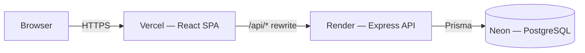

# Life Tracker

Life Tracker is a personal app for tracking daily life. This first version covers user authentication and a dashboard. Later versions will add work scheduling, fitness tracking, nutrition tracking, and personal finance tracking.

**Live demo:** [life-tracker-brown-one.vercel.app](https://life-tracker-brown-one.vercel.app)

## Why this project exists

I built this project for two reasons.

First, I want to use it myself. I want one place to track my daily routine instead of using several different apps.

Second, this project is part of my software engineering portfolio. My other public projects use older tools like plain HTML, CSS, and Bootstrap. They do not show my experience with React, Node.js, Docker, or CI/CD pipelines. This project is built with those tools from the start. It also follows real industry practices, like automated testing, pull request reviews, and accessibility standards.

## What is in version 1

Version 1 only has two features, but they are built properly:

- User authentication, including signup, login, and secure sessions
- A dashboard that shows the logged in user's profile and placeholder cards for features that are coming later

## What comes next

After version 1 is finished, future versions will add:

- Work and shift scheduling
- Fitness and workout tracking
- Nutrition and protein tracking
- Personal finance tracking

## Screenshots

<!-- Add real screenshots here, e.g.: -->
<!--  -->
<!--  -->

_Screenshots coming soon._

## Tech stack

| Layer | Choice |
|---|---|
| Frontend | React, TypeScript, Vite, Tailwind CSS, React Router, Zustand |
| Backend | Node.js, Express, TypeScript |
| Database | PostgreSQL, Prisma |
| Auth | JWT (short-lived access token in memory, httpOnly refresh cookie), bcrypt |
| Containers | Docker, Docker Compose |
| CI | GitHub Actions (lint, typecheck, test, build on every PR; required before merge) |
| Testing | Vitest, Testing Library, jest-axe (accessibility) |
| Code quality | ESLint, Prettier, Husky |
| Hosting | Vercel (frontend), Render (backend), Neon (database) |

## Architecture



The frontend and backend are deployed on different domains. Browser requests to `/api/*` are transparently proxied through Vercel to the Render backend, so the browser always talks to a single origin — this avoids third-party cookie blocking on the httpOnly refresh-token cookie, which modern browsers restrict across genuinely different domains.

Locally, `docker-compose.yml` runs both apps plus a Postgres container on the same machine, talking directly to each other over the compose network — no proxy needed there since everything is same-origin (`localhost`) already.

## Project layout

This repository has two main folders: `backend` and `frontend`. Each one is its own separate project with its own `package.json`.

I chose not to use workspace tooling, like pnpm workspaces or a monorepo tool. A plain two-folder repo is simpler to set up and easier to understand. It also fits the time I have for this project. If the project grows a lot in the future, I may switch to workspace tooling then.

## Running this locally

You need Docker installed. You do not need Node or PostgreSQL installed on your own machine, since Docker runs both for you.

1. Clone the repository.
2. Copy `backend/.env.example` to `backend/.env`, and `frontend/.env.example` to `frontend/.env`.
3. From the repository root, run:
   ```
   docker compose up --build
   ```
4. The first time you run this, the database exists but has no tables yet. In a separate terminal, run the first migration:
   ```
   cd backend
   npx prisma migrate dev
   ```
5. Open `http://localhost:5173` for the frontend, and `http://localhost:4000` for the backend.

If you add a new npm dependency to either app while the containers are already running, a plain restart is not enough — Docker keeps each app's `node_modules` in its own anonymous volume, separate from your local files. Rebuild that service with a fresh volume instead:
```
docker compose up -d --build -V <service>
```

## Running tests

Backend tests use Vitest, including integration tests against a real (test-only) database:

```
cd backend
npm run test
```

Frontend tests use Vitest and Testing Library, including automated accessibility checks (jest-axe) on the login, signup, and dashboard pages:

```
cd frontend
npm run test
```

## Accessibility

This project targets WCAG 2.1 AA. Concretely, that means:

- Every form field has a real label, and validation errors are announced to screen readers (`role="alert"`, `aria-describedby`)
- Every text/background color pair meets the 4.5:1 AA contrast ratio
- All interactive elements have a visible keyboard focus indicator
- A skip-to-content link lets keyboard users bypass repeated navigation
- Heading levels are sequential (no skipped levels) on every page
- Automated accessibility tests (jest-axe) run in CI on every pull request, so a regression here fails the build, not just a one-time manual check

## Development workflow

Work happens on a `feature/*` branch, gets reviewed via a pull request into `staging`, and is periodically promoted to `main` the same way. GitHub Actions runs lint, typecheck, test, and build on every pull request, and branch protection on `main` requires all of them to pass before a merge is even possible. Both `main` and `staging` auto-deploy: `main` to the live production URLs above, `staging` to preview deployments for review before promotion.
